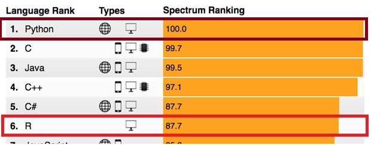

## ISRC R Workshop Series

.center[]

.pull-left[

*Fall*

* R Basic
* Data Manipulation
* Quantitative Analysis
* Basic Data Visualization
]

.pull-right[

*Spring*

* R Basics (again)
* Geographic Data Visualization
* Multilevel Model
* Professionalization

]

--

Check out other [fantastic workshops](http://ppc.uiowa.edu/node/3608) offered by us.

---

## How to Get the Slides?

All the slides are presented in my personal webpage:

1. Search "Yue Hu" in Google or directly type the webpage([sammo3182.github.io](https:\\sammo3182.github.io)) at any browser you prefer.
1. Click "Teaching" tab in the upper-right corner.
1. Find "Course: Hello, R: A Introduction To R, Iowa Social Science Research Center, University of Iowa" and click the "slides."

.center[]

---

## What's R?

R is an .magenta[object-oriented] language and environment for .magenta[statistical] computing and graphics.

--

* .magenta[Object-oriented] system: Put things in to boxes and carry around.

--

* Created for .magenta[statistics]:
    + Built by statisticians and data scientists.
    + Edit codes from Excel, STATA, Python, C++, ...
    + Scrape data from texts, websites, databases, pdf...
    + Create webpages (see, e.g., [`blogdown`](https://bookdown.org/yihui/blogdown/).)
    + Write academic articles and save them in html, pdf, or word.
    + Create presentation slides in pdf (as LaTex beamer), html (as Markdown).
    + Write a book or dissertation (see e.g., [`bookdown`](https://bookdown.org/home/).)

---

## Why R?

* FREE!!!

--

* Developing
    + `r nrow(available.packages())`+ packages.
    + Compatible with new statistical and visualization techniques.
    
--

* Popular

--

.center[]
.pull-right[.small[[Source:  IEEE Spectrum ranking](https://spectrum.ieee.org/computing/software/the-2017-top-programming-languages)]]

---

## Hey, Python?

.center[]

--

* R vs. Python: "The war that never ends..."

---

## R vs. Python

.pull-left[
### R

#### Advantages

* Statistics
* Visualization

#### Inconvenience

* Reading large-size (> 1G) data
* Learning the codes
]

.pull-right[
### Python

#### Advantages

* Machine learning
* Big data manipulation

#### Inconvenience

* Setting up at certain platform
* 2.7 vs. 3.5?
* Checking the outcomes

]

---

## R vs. STATA

.pull-left[
### R

#### Advantages

* Updating
* Flexible
* Multi-lingual

#### Inconvenience

* Linear-algebraic calculation
* Programming

]

.pull-right[
### STATA

#### Advantages

* Stable
* Reliable

#### Inconvenience

* You use what you get
* Poor visualization
* Long updating schedule
* EXPENSIVE: 
    + Perpetual for students:	**$995** (new) / **$325** (updates) 

]

---

## Let's start our journey!

.center[]

---

## Program Installation

.pull-left[
### Core program

[](https://www.r-project.org/)

]

--

.pull-right[
### Graphic User Interfaces (GUI)

[](https://www.rstudio.com/)

]

---

## Package Installation

.pull-left[

* What's package?


]

--

.pull-right[

* Installing:

`install.packages(<package name>)`

`devtools::install_github("<repositary/package name>")`

* "Clicking":

`library(<package name>)`

`require(<package name>)`

]

---

## First-Time Using

Set the working directory! Set the working directory! Set the working directory!

.pull-left[

* Always check or set the <span style="color:red">working directory</span> first

```{r eval = FALSE}
# find the current working directory
getwd() 

# Reset the working directory
setwd("E:/R workshop/rworkshop") 
```
    
]

.pull-right[

* Or click, click, and click in Rstudio


]

---

## Terminology

From linear algebra:

--

### Matrix

.pull-left[


]

--

.pull-right[

```{r}
A <- matrix(-8:7, ncol = 4)
A
A[2, 3]
```

]

---

### Vector: 

One-row / one-column matrix

```{r}
# Numeric
c(1, 2, 3) # Integer
c(1.5, -2.34, NA) #Double
# Factor
factor(c(1, 2, 2, 3), labels = c("Apple", "Pear", "Orange"))
# Character
c("R is hard.", "But I can learn.")
```

---

```{r}
# Time
as.POSIXlt("2005-10-21 18:47:22")

# Logic
c(TRUE, TRUE, FALSE)
```


---

### Data frame (tidy)

A special matrix with observations in rows and variables in columns.

```{r}
knitr::kable(head(mtcars), format='html')
```

--

.pull-left[
```{r}
mtcars[1,1]
```
]

--

.pull-right[
```{r}
mtcars$mpg[1]
```

]

---

### Array

A multi-dimension matrix

```{r}
array(-9:9, dim = c(3,3,2)) 
# three dimensions with 3, 3, and 2 elements in each dimension.
```

---

### List

A series of everything.

```{r}
aList <- list(c(1:5), letters[1:5])
aList
aList[[2]]
```

---

## Functions

.center[]

--

```{r}
light <- function(finger){
  {{shadow <- finger + 5}}
}

handShadow <- light(finger = 3)
handShadow
```

---

## Data Input and Output


### Build-in functions

```{r eval=FALSE}
load("<FileName>.RData")

df_rds <- readRDS("<FileName>.rds")
df_txt <- read.table("<FileName>.txt")
df_csv <- read.csv("<FileName>.csv")

```


---

### Package functions

```{r eval=FALSE}
# SPSS, Stata, SAS
library(haven)
df_spss <- read_spss("<FileName>.sav")
df_stata <- read_dta("<FileName>.dta") 
df_sas <- read_sas("<FileName>.sas7bdat")  

# Excel sheets
library(readxl)
df_excel <- read_excel("<FileName>.xls")
df_excel2 <- read_excel("<FileName>.xlsx") 

# JavaScript Object Notation 
library(rjson)
df_json <- fromJSON(file = "<FileName>.json" )

# XML/Html
df_xml <- xmlTreeParse("<url>")
df_html <- readHTMLTable(url, which=3)

```


---

## Data output

* Save single object in a `.rds` file

```{r eval = F}
saveRDS(object, file = "./Data/mydata.Rdata")
```

* Save multip objects into an R dataset (`.RData`/`.rda`) 

```{r eval = F}
save(object, file = "./Data/mydata.Rdata")
```

* Save multip objects into a CSV sheet `.csv`

```{r eval = F}
write.csv(object, file = "mydata.csv")
```


---

## Programming Basics: Math

```{r eval=FALSE}
# basic math
x + (1 - 2) * 3 / 4

# advanced math
x^2;sqrt(x);log(x);exp(x)

# matrix algebra
z <- matrix(1:4, ncol = 2)
z + z - z
z %*% z  # inner mul<span style="color:purple">Tip</span>lication 
z %o% z  # outter mul<span style="color:purple">Tip</span>lication

# logical evaluation
x == z; x != Z
x & z; x | z
x > z; x <= z
```


---

## Naming Objects

* Don't start with numbers (WRONG: `1stday`)

--

* No special signs except for `.` and `-` (WRONG: `M&M`)

--

* Case sensitivity (`X != x`)

--

* Don't overwrite the build-in functions unless necessary (DON'T: `list <- c(1:5)`)


---

## Last Words

* Being aware of the learning curve

.center[]
.pull-right[.small[[Source: NYU Data Service](https://sites.google.com/a/nyu.edu/statistical-software-guide/summary)]]

---

* Preparing for unexpected troubles

```{r}
testDF <- data.frame(x = c(1, 1, 1, NA, 4, 4),
                     y = c(2, 2, 2, 2, 2, 2))
testDF
```

--

```{r eval = FALSE}
testDF$x[testDF$x < 4] <- testDF$y[testDF$x < 4]
```

```
Error in testDF$x[testDF$x < 4] <- testDF$y[testDF$x < 4] * 0 : 
  NAs are not allowed in subscripted assignments
```

--

```{r}
testDF$x <- ifelse(testDF$x < 4, testDF$y, testDF$x)
testDF$x 
```

---

* Sufficiently using online sources

.center[]

---

## That's It.

.center[]
